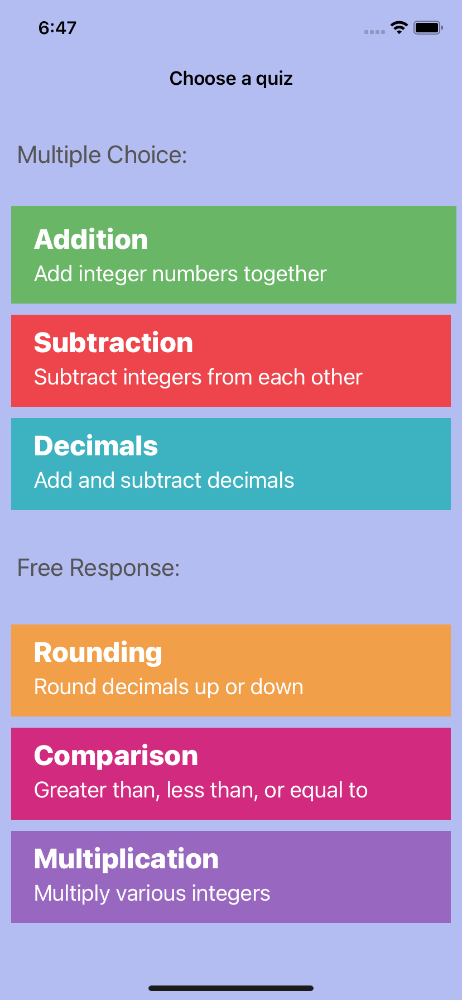
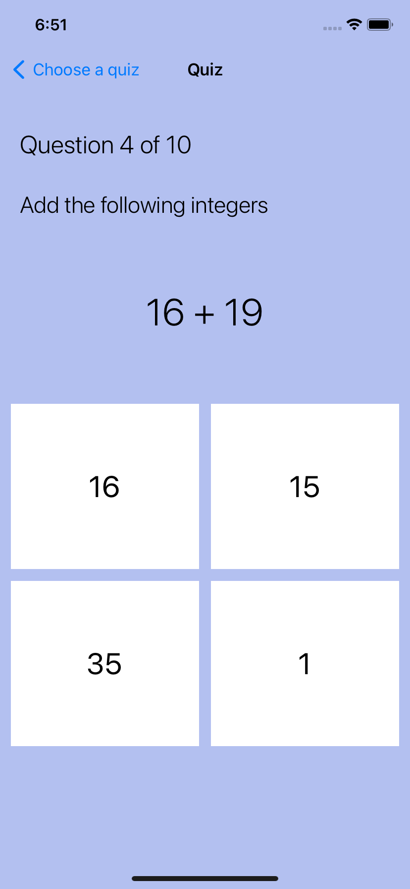
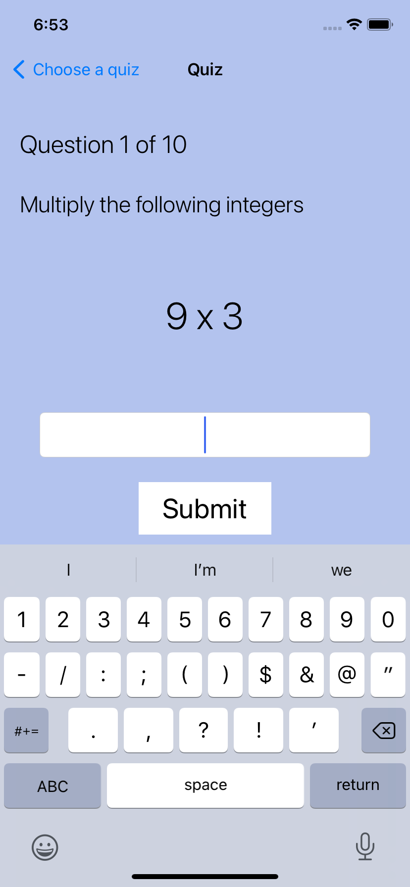
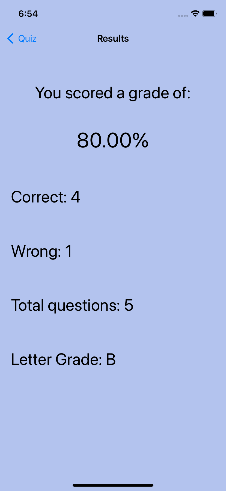

# CIS 200 - Apple App Development
This is an iOS mobile app that I created as the final project for my Apple App Development class.

# App Description
This app allows users to practice and refresh their math skills by testing them through quizzes of their own choice. The app features math quizzes with topics such as addition, subtraction, multiplication, and much more. These topics can be selected from either a multiple-choice format, or through a short answer response that the user enters by typing.

After successfully completing a quiz, users will be met with a screen that displays how they performed. These results consist of a grade percentage, letter grade, correct answers, and incorrect answers.

# Screenshots
Main Screen 

  
Addition Quiz 

  
Multiplication Quiz 

  
Results Screen 
